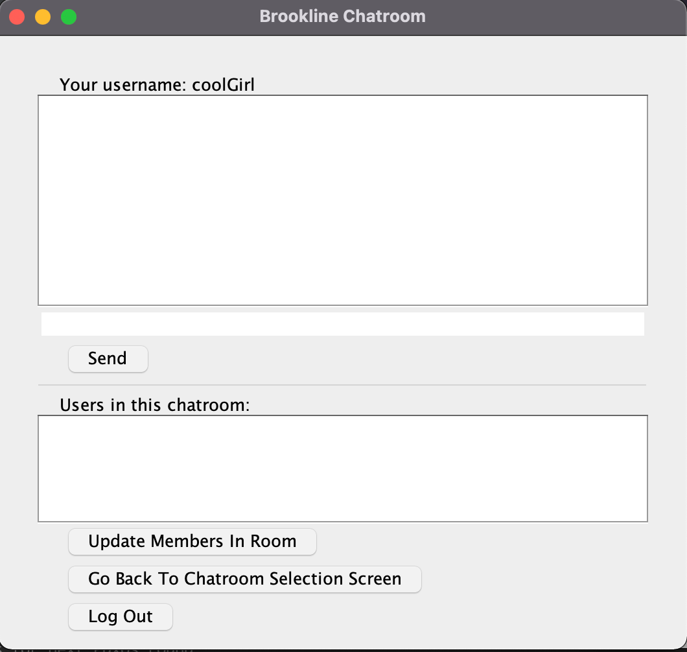
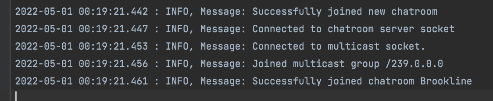
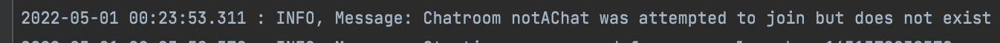

# CS6650 Chatroom Project

## Pre-compiling Instructions
If you do not have Maven installed on your machine, please either 1) consult this webpage https://maven.apache.org/download.cgi or 2) use homebrew and run the following in your terminal:
```
brew install maven
```

## Compiling / Running Instructions
Since this is a Maven project, you should use the terminal to cd into the root directory of this project (6650_chatroom_project), and run the following command to create an executable JAR file:
```
mvn package
```
Now, dependencies should have been installed and an executable JAR file should have been created in the target directory. This JAR file's argument should be either "client" or "server". While still in the root directory (6650_chatroom_project), you can create the server as by running the following command:
```
java -jar target/6650_chatroom_project-1.0-SNAPSHOT.jar server
```
The syntax for running a client is as follows:
```
java -jar target/6650_chatroom_project-1.0-SNAPSHOT.jar client
```

## Operation Instructions
### To test the program, run the server as shown above in a terminal, and then run one or more clients as shown above in each of their own terminals. Use cases related to the 3 client GUI screens are given below. Please watch demo video for an example of how to use program.
1. Login/Register: When a client program is run by executing the JAR file with the “client” argument, a Login/Register screen first appears. A user can choose to login to an existing account if they have already registered one with a username and password. The account with username “admin” and password “password” is registered in the system by default. If a user does not fill out both of the textboxes for username and password before clicking “Login” then a bright red toast message (transient) will appear notifying the user to fill them out. If a user attempts an incorrect username or password then a bright red toast message will appear notifying them that it the credentials are incorrect. Upon logging in with a valid username and password, the user’s client GUI will change to the Chat Selection screen. As for registering, if a user does not fill out both of the textboxes then the aforementioned bright red toast message will notify them of such. If the user attempts to register an account with an existing username then a different bright red toast message will appear. Upon registering a unique username and valid password, the user’s client GUI will change to the Chat Selection screen.
2. Create/Join Chatroom: In this screen, a user can choose to either join an existing chatroom or create a new one with a unique chatroom name. The existing chatrooms and the number of users currently in them are shown at the bottom of the page. If a user wants to join a chatroom then they must input the name of one of the chatrooms shown and click “Join”. If a user attempts to click “Join” while the textbox is empty then a bright red toast message will appear notifying the user of this. If a user attempts to join a non-existent chatroom then a different bright red toast message will notify the user of this. Clicking “Join” with an existing chatroom name in the textbox will open the Chatroom GUI screen. If a user wants to create a chatroom then they must input a non-existent chatroom name in the rightmost textbox and click “Create”. If a user attempts to click “Create” while the textbox is empty then a bright red toast message will appear notifying the user of this. If a user attempts to create a chatroom with the same name as an existing chatroom then a bright read toast message will notify them of this. Clicking “Create” with a unique chatroom name will open the Chatroom GUI screen for the client and also open a ChatroomServer GUI screen since this user is now the host. 
3. In Chatroom: Both hosts and non-hosts can send messages to the chatroom server that are multicast to all client members of the chatroom, and thus appear on the display text-areas for each client GUI. Failing to include any text in the textbox before clicking “Send” will result in a bright red toast message notifying user to include text. A user can click “Update Members In Room” in order to see who else is currently in the chatroom. Furthermore, the display for all messages and the display for members in the chatroom both employ smart scrolling in which the screen will naturally show the most recent message, but if a user is scrolling back to look at old messages then it will not automatically scroll back down when a new message is sent. Differences in host vs non-host use cases are explained further:
      1. For a non-host client, clicking “Go Back To Chat Selection Screen” will do just that as well as remove the user from the chatroom. Clicking “Log Out” will log the user out, remove them from the chatroom, and open the Login/Register screen. Closing the GUI window will stop the process, remove the user from the chatroom, and log them out.
      2. For a host client, clicking “Go Back To Chat Selection Screen” when no other members are in the chatroom will remove the chatroom server screen, remove the chatroom from existence, and open the Chat Selection screen for the client GUI. Clicking “Log Out” in the same situation with no other members will do the same things and also log the user out and open the Login/Register screen instead of the Chat Selection screen. In the same situation with no other members, closing out of the chatroom server GUI or client GUI will remove both GUIs, remove the chatroom from existence, and log the user out. However, in any of these situations where a host user leaves but there are other members, then a LookUp Server will choose a new member client to create a chatroom server on their process that will open the chatroom server GUI with the history of all chatroom messages.

***
***
***
## Testing
Please watch demo video for display of more examples of application use cases.

### This section shows a user logging in successfully. They use the default account with username "admin" and password "password". Shown in order from top to bottom are client GUI before/after, client log, and LookUpServer log.

***

***

***

***
***

### This section shows a user attempting to log in with an invalid username/password. Shown in order from top to bottom are client GUI before/after, client log, and LookUpServer log.

***

***

***

***
***

### This section shows a user attempting to log into an account that is already logged in. Shown in order from top to bottom are client GUI before/after, client log, and LookUpServer log.

***

***

***

***
***

### This section shows a user registering an account successfully. Shown in order from top to bottom are client GUI before/after, client log, and LookUpServer log.

***

***

***

***
***

### This section shows a user attempting to register an account that uses an existing username. Shown in order from top to bottom are client GUI before/after, client log, and LookUpServer log.

***

***

***

***
***


### This section shows a user creating a chatroom successfully. Shown in order from top to bottom are client GUI before/after (after includes Chatroom server GUI too), client log, LookUpServer log, and chatroom server log.

***

***

***

***

***
***

### This section shows a user attempting to create a chatroom with a name that already exists. Shown in order from top to bottom are client GUI before/after, client log, and LookUpServer log.

***

***

***

***
***

### This section shows a user joining a chatroom successfully. Shown in order from top to bottom are client GUI before/after, client log, and LookUpServer log.

***

***

***

***
***

### This section shows a user attempting to join a chatroom with a chatroom name that does not exist. Shown in order from top to bottom are client GUI before/after, client log, and LookUpServer log.

***

***

***

***
***

### This section shows a user clicking Logout while in chatroom selection screen. Shown in order from top to bottom are client GUI before/after, client log, and LookUpServer log.

***

***

***

***
***


### This section shows a user sending a message to a chatroom while other user is also in the chatroom to receive it. Shown in order from top to bottom are client / chatroomServer GUIs before/after, client logs, and LookUpServer log.

***

***

***

***
***

### This section shows a user updating the users currently in the chatroom. Shown in order from top to bottom are client GUI before/after, client log, and LookUpServer log.

***

***

***

***
***

### This section shows a non-host user clicking back to chat selection screen. Shown in order from top to bottom are client GUI before/after, client log, chatroom server log, and LookUpServer log.

***

***

***

***
***

### This section shows a host user clicking back to chat selection screen. Shown in order from top to bottom are client / chatroomServers GUIs before/after, host client log, non-host client log, chatroom server log, and LookUpServer log.

***

***

***

***

***

***
***

### This section shows a host user exiting out of its window, and thus stopping the process that BOTH its client AND the chatroomServer are running on. Shown in order from top to bottom are client / chatroomServer GUIs before/after, host client log, non-host client log, chatroom server log, and LookUpServer log.

***

***

***

***

***
***


### This section shows two users, where they are each in their own chatroom that they host. When they send messages, the messages only go to their own chatroom. Shown in order from top to bottom are client / chatroomServer GUIs before/after, client Jonathan log, client Mary log, chatroom server Jonathan log, chatroom server Mary log, and LookUpServer log.

***

***

***

***

***

***

***
***

### This section shows a PAXOS round being undertaken when a user logs into the account with username "admin". Shown in order from top to bottom are proposer LookUpServer log, acceptor LookUpServer log, and learner LookUpServer log.

***

***

***
***
